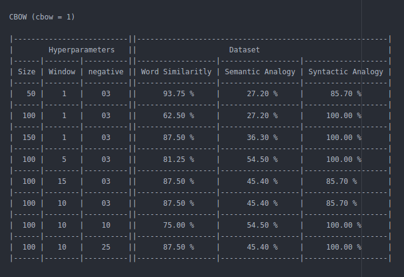
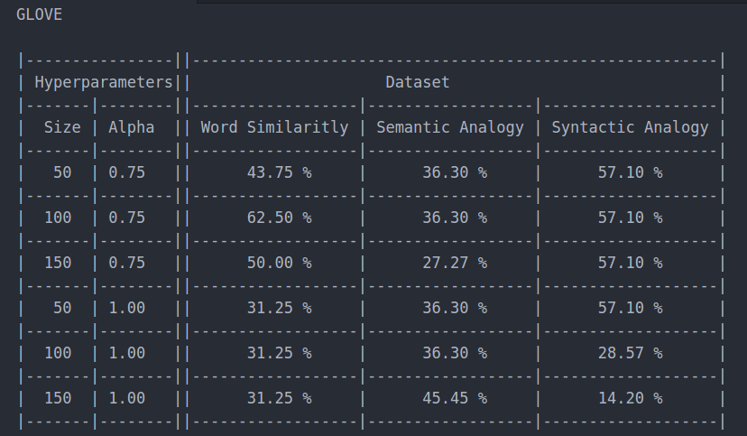
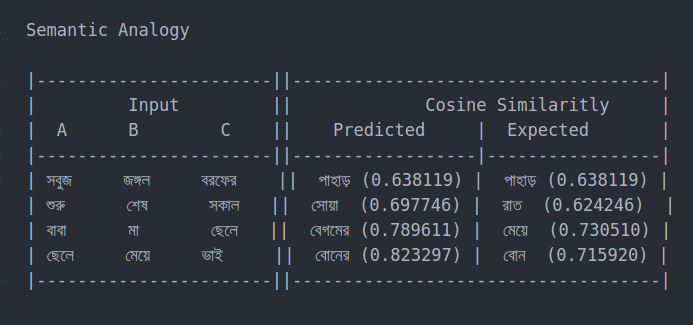
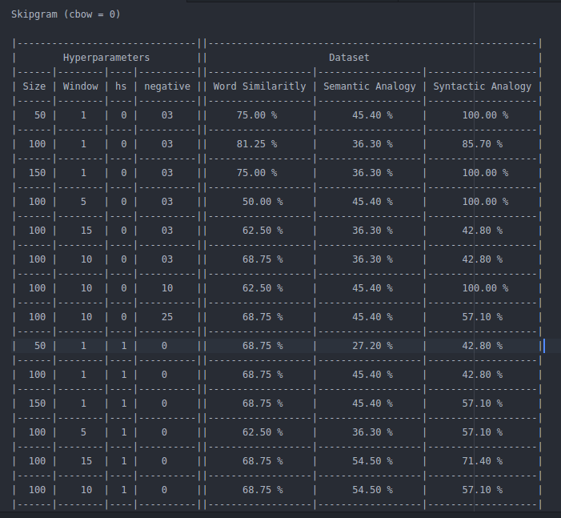
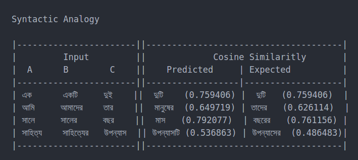
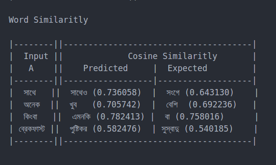

# Word2Vec

In this assignment we trained word representations for Bengali language.

## Getting Started

* The source code of the 3 models : GloVe, Skip-gram and CBOW is present in the `src` directory. To run the above models, find the instructions in the folder specific README file.
* The test cases are present in the folder named testcases.

## Observations 

For more details, refer to Section 10 of the `report.pdf`
## Experiments
Please find all the experiments that we conducted in the `report.pdf`.

## Authors
* **Pritha Ganguly** - [gangulypritha](https://github.com/gangulypritha)
* **Nitesh Methani** - [NiteshMethani](https://github.com/NiteshMethani)

## Acknowledgments
* All the acknowledgements can be found in the Reference section of `report.pdf`
